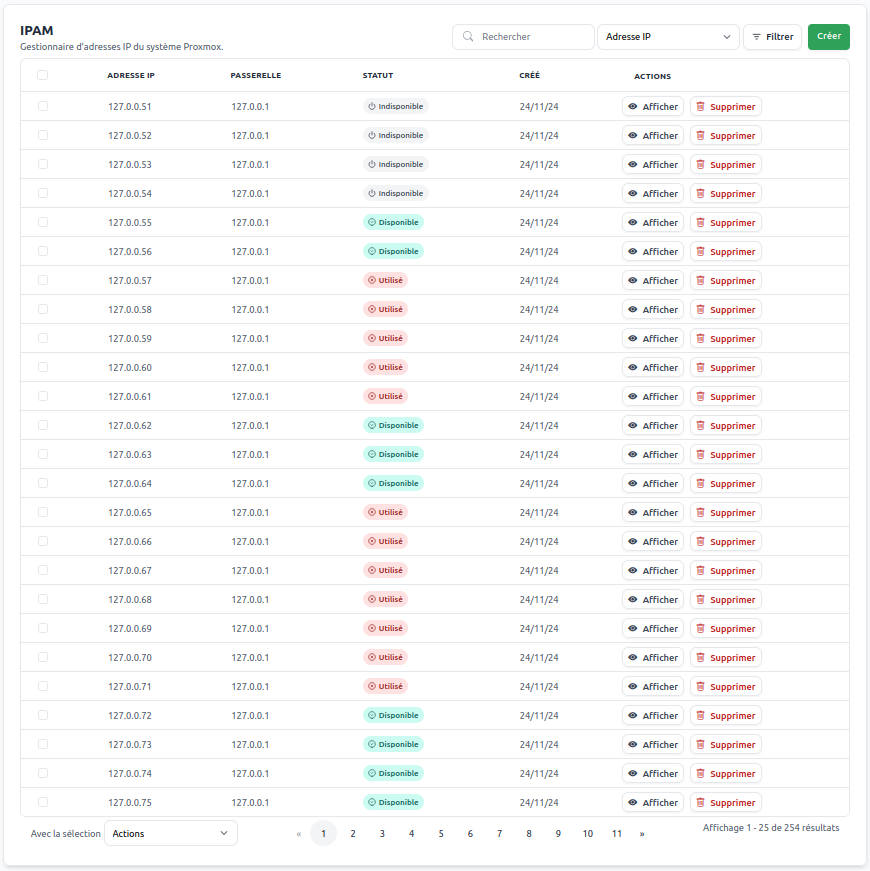
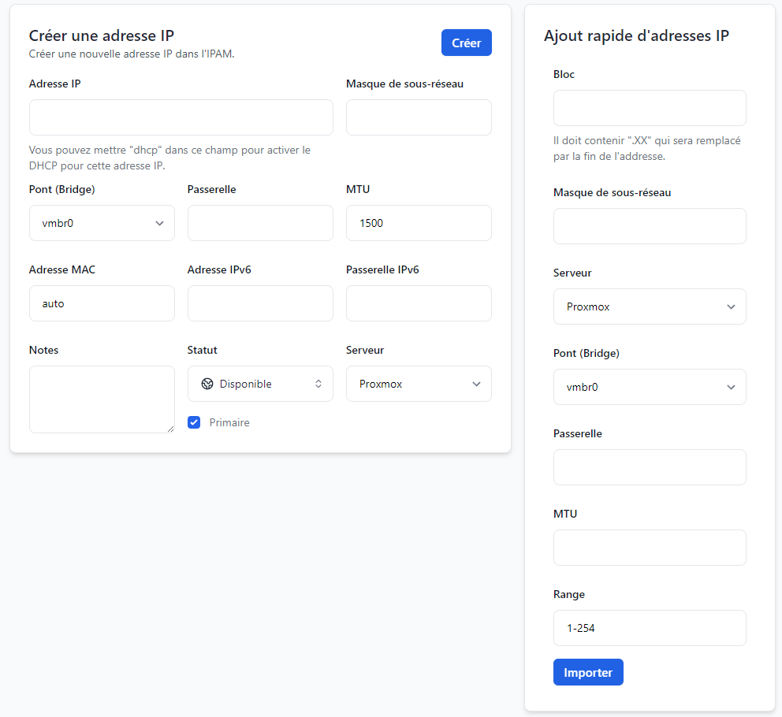
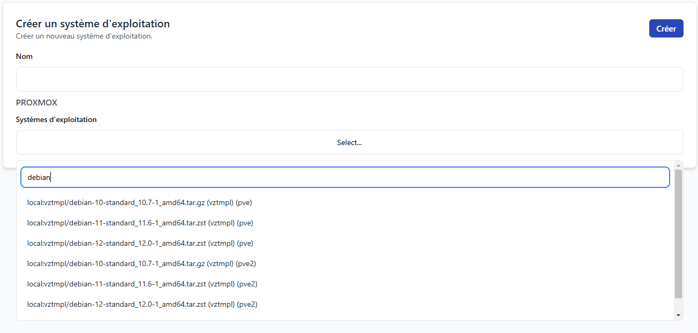
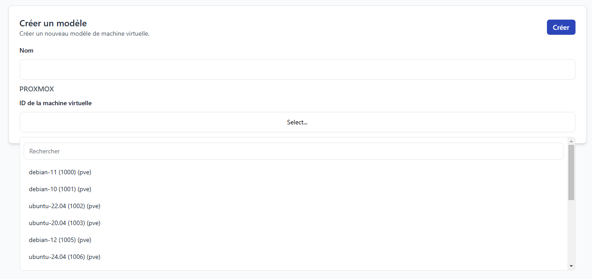

# Proxmox

Proxmox est une plateforme populaire permettant de gérer des serveurs virtuels et des conteneurs de manière rapide et intuitive. Ce module vous permet de créer et de gérer automatiquement des VPS pour vos clients, selon les ressources et les performances choisies. Vous pouvez ainsi vendre différents types de machines virtuelles ou de conteneurs, adaptés aux besoins de vos clients.

:::info Modules
Pour utiliser les fonctionnalités décrites ci-dessous, vous devez activer le module Proxmox dans **ClientXCMS**.
:::

## Authentification

ClientXCMS utilise le système d'API de PVE (Proxmox Virtual Environment) pour garantir une connexion sécurisée et fiable avec votre cluster Proxmox.

### Étapes de configuration du serveur

Pour connecter ClientXCMS à votre serveur Proxmox, suivez ces étapes :

#### 1. Activer le module Proxmox

Assurez-vous que le module Proxmox est activé dans **ClientXCMS**.

#### 2. Configurer un serveur Proxmox dans ClientXCMS

1. Connectez-vous à votre espace d'administration ClientXCMS.
2. Allez dans **Paramètres** > **Paramètres généraux** > **Serveurs**.
3. Cliquez sur **Créer**, puis sélectionnez **Proxmox** comme type de serveur.

Remplissez les informations suivantes :

- **Nom :** Le nom que vous souhaitez attribuer au serveur Proxmox.
- **Type de serveur :** Proxmox.
- **Nom d'hôte :** Le nom d'hôte du Proxmox VE.
- **Adresse IP :** L'adresse IP du Proxmox VE.
- **Port :** Le port par défaut est `8006`. Si vous avez configuré un proxy avec SSL, vous pouvez utiliser `443` ou `80`.
- **Token ID :** L'ID du jeton Proxmox pour l'API.
- **Secret :** Le secret associé au jeton Proxmox pour l'API.

#### 3. Générer un Token API dans Proxmox

1. Connectez-vous à votre interface Proxmox VE.
2. Accédez à **Datacenter (XXX)** > **Permissions** > **API Tokens**.
3. Cliquez sur **Add** pour créer un nouveau jeton API.

   Remplissez les informations suivantes :
   
   - **User :** `root@pam`
   - **Token ID :** Choisissez un nom pour votre jeton, par exemple `clientxcms`.
   - **Privilege Separation :** Désactivez cette option en la décochant.

4. Cliquez sur **Add** pour finaliser la création du jeton.

#### 4. Récupérer le Token ID et le Secret

Dans le **modal** qui s'ouvre, copiez les valeurs **Token ID** et **Secret**. Ces informations seront nécessaires lors de la création du serveur dans ClientXCMS (étape 2).

#### 5. Tester la connexion

Une fois les informations d'authentification saisies dans la page de création du serveur, cliquez sur **Vérifier** pour tester la connexion. Si le statut renvoyé est `200` et que le message ``Connection successful`` apparaît, vous pouvez cliquer sur **Créer** pour ajouter votre serveur Proxmox à ClientXCMS.

## **Importation des adresses IP**

Dans ClientXCMS, vous pouvez importer des adresses IP pour les assigner à vos VPS clients. Pour ce faire, suivez ces étapes :  

1. Rendez-vous dans l'espace d'administration de ClientXCMS.  

2. Allez dans **Paramètres > Catégorie "Proxmox" > "IPAM"**. 
Vous pouvez voir un tableau avec la liste des IPs que vous avez alloué pour vos clients VPS, et leur statut.

3. Cliquez sur le bouton **"Créer"** en haut à droite de la page.  
  

### **Options disponibles**
Deux modes d'importation sont disponibles :  
- **Créer une adresse IP** : Ajouter une seule adresse IP unique.  
- **Ajout rapide d'adresses IP** : Importer une plage (pool) d'adresses IP successives.  

### **Créer une adresse IP (unique)**

Remplissez les champs suivants :  

- **Adresse IP** : IPv4 à ajouter, au format `X.X.X.X`.  
- **Masque de sous-réseau** : Généralement `24` (correspond au CIDR de votre réseau).  
- **Pont (Bridge)** : Identifiant du bridge dans votre configuration réseau Proxmox.  
- **Passerelle** : IPv4 de la passerelle, au format `X.X.X.Y` (souvent `1` ou `254`, selon la configuration de votre routeur ou transitaire réseau).  
- **MTU** : Par défaut `1500`. Modifiez cette valeur uniquement si nécessaire.  
- **Adresse MAC** :  
  - Par défaut `auto` (générée automatiquement par Proxmox).  
  - Optionnellement, définissez une adresse MAC statique si vos besoins l’exigent.  
- **Adresse IPv6 et Passerelle IPv6** : Champs similaires pour IPv6.  
- **Notes** : Ajoutez une annotation pour organiser vos adresses.  
- **Statut** : Sélectionnez l’état de l’adresse : Disponible, Indisponible, ou Utilisée.  
- **Serveur** : L'ID du serveur Proxmox associé à cette adresse IP.  

Cliquez sur **"Créer"** pour enregistrer l'adresse IP. Un message de confirmation s'affichera si l'adresse a été importée avec succès.  

### **Ajout rapide d'adresses IP (range)**

Pour importer un bloc d'adresses IP, complétez les champs suivants :  

- **Bloc** : Saisissez le bloc IP sous la forme `A.B.C.XX`. Le **`XX`** sera remplacé automatiquement par les numéros de la plage définie.  
- **Masque de sous-réseau** : Généralement `24` (CIDR).  
- **Serveur** : L'ID du serveur Proxmox où les adresses seront assignées.  
- **Pont (Bridge)** : Identifiant du bridge dans votre réseau Proxmox.  
- **Passerelle** : IPv4 de la passerelle du bloc, au format `X.X.X.Y` (souvent `1` ou `254`).  
- **MTU** : Par défaut `1500`. Modifiez cette valeur uniquement si nécessaire.  
- **Range** : La plage des adresses IP à ajouter, sous la forme `A-Z`.  

> **Exemple :**  
> Pour importer les adresses de `192.168.1.10` à `192.168.1.199` :  
> - **Bloc** : `192.168.1.XX`  
> - **Range** : `10-199`  

Cliquez sur **"Importer"** pour ajouter la plage d'adresses. 

## **Ajouter des systèmes d'exploitation LXC (OS) et modèles KVM (templates CloudInit)**

:::info 
Si vous gérez plusieurs serveurs (nœuds ou clusters), assurez-vous que le système d'exploitation ou le modèle est correctement configuré sur un disque appartenant au nœud Proxmox de chaque serveur concerné.  
:::

### **Ajouter un système d'exploitation (pour LXC)**

1. Accédez à l'espace d'administration de ClientXCMS.  
2. Naviguez vers **Paramètres > Catégorie "Proxmox" > "Systèmes d'exploitation"**.  
3. Cliquez sur le bouton **"Créer"** en haut à droite de la page.  
  

Complétez les champs suivants :  
- **Nom** : Nom du système d'exploitation visible lors de la configuration d’un VPS (exemple : *Debian 12*).  
- **Systèmes d'exploitation** : Identifiant du modèle de conteneur (CT) situé sur les disques des serveurs.  

Une fois les informations remplies, cliquez sur le bouton **"Créer"**. Un message de confirmation s'affichera si l'opération a réussi.  

### **Ajouter une template CloudInit (pour KVM)**

1. Accédez à l'espace d'administration de ClientXCMS.  
2. Naviguez vers **Paramètres > Catégorie "Proxmox" > "Modèles"**.  
3. Cliquez sur le bouton **"Créer"** en haut à droite de la page.  
  

Complétez les champs suivants :  
- **Nom** : Nom du modèle qui apparaîtra lors de la configuration d’un VPS (exemple : *Windows Server 2025*).  
- **ID de la machine virtuelle** : Identifiant de la VM utilisée comme modèle sur les différentes nodes Proxmox VE.  

Cliquez ensuite sur **"Créer"**. Vous recevrez une confirmation si le modèle a été ajouté avec succès.  

:::tip  
N’oubliez pas d’intégrer les systèmes d’exploitation et modèles dans la configuration de vos produits Proxmox. Cela garantit qu’ils seront disponibles pour vos clients lors de leurs commandes.  
:::  